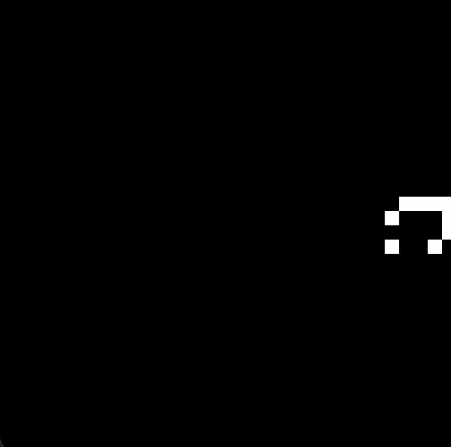
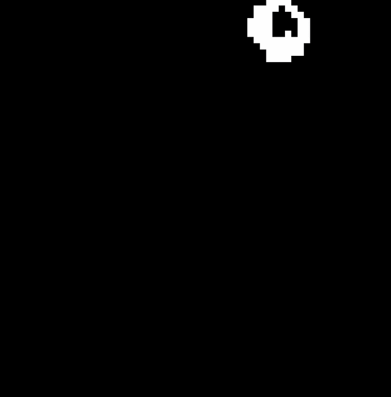
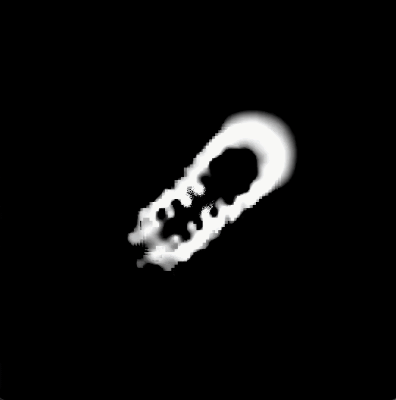

<h1 align="center">ALife</h1>

  <em>
    An artificial life simulator: Implementing Conway's Game of Life,
    Larger-than-Life, SmoothLife, and Lenia.
  </em>

<table align="center" cellspacing="0" cellpadding="0">
  <tr>
    <td></td>
    <td></td>
    <td></td>
  </tr>
  <tr>
    <td></td>
    <td></td>
    <td></td>
  </tr>
  <tr>
    <td></td>
    <td></td>
    <td></td>
  </tr>
</table>

## Resources

This project was implemented with reference to the following papers:
- [Rafler, S. (2011). *Generalization of Conway's "Game of Life" to a Continuous Domain — SmoothLife*](https://arxiv.org/abs/1111.1567)
- [Chan, B. (2019). Lenia - Biology of Artificial Life](https://arxiv.org/abs/1812.05433)
- [Chan, B. (2020). *Lenia and Expanded Universe*](https://arxiv.org/abs/2005.03742)

As well as the following online resources:
- [OpenLenia Tutorial](https://github.com/OpenLenia/Lenia-Tutorial)
- [Lenia Project Website](https://chakazul.github.io/lenia.html)
